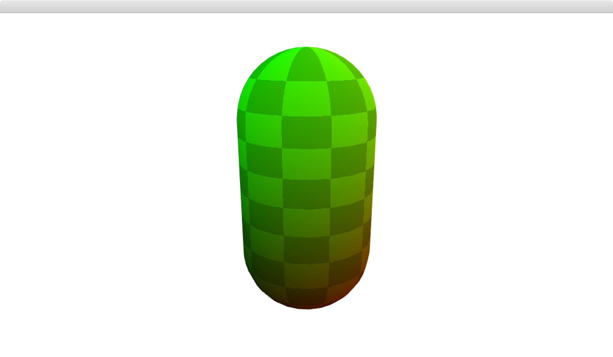

# primitive-capsule

[](http://github.com/badges/stability-badges)

A minimal capsule geometry for 3D rendering, including normals, UVs and cell indices (faces).

## Usage

[](https://www.npmjs.com/package/primitive-capsule)

#### `mesh = createCapsule([r, h, n])`

Parameters:  
`r` - radius, defaults to 1  
`h` - height, defaults to r/2  
`n` - resolution, defaults to 32

## Example

```javascript
var createCapsule = require('primtivie-capsule');
var capsule = createCapsule();
```

`capsule` will have the following structure:

```
{
  positions: [ [x, y, z], [x, y, z], ... ],
  cells: [ [a, b, c], [a, b, c], ... ],
  uvs: [ [u, v], [u, v], ... ],
  normals: [ [x, y, z], [x, y, z], ... ]
}
```

## Demo

Download or clone this repo and run:

```
cd demo
npm install
npm start
```

## Credits

Ported from C++ code from Cinder https://github.com/cinder/Cinder

## License

MIT, see [LICENSE.md](http://github.com/vorg/primitive-capsule/blob/master/LICENSE.md) for details.
